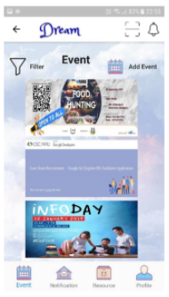
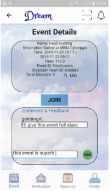
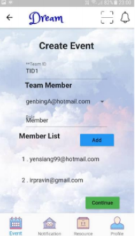
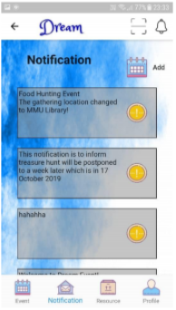
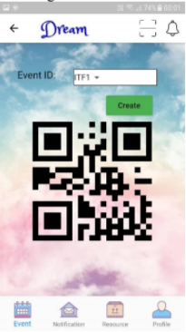
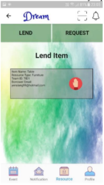

# Dream Mobile Event Application

Flutter is used as the framework for developing this application.

This is a project regarding school event management system, built for students, parents, lecturers to create or join an event in school. This can help the related parties to get involved in the schools' events. User may create events, join events, join subgroups scan qr scan for attendance. 

## Sample images

  
  
  
  

  
  
  

## Details of this application
Report 1: https://drive.google.com/file/d/19CdHd5pbB9gFGSV-XcpCjZamFMqe0ipH/view?usp=sharing  
Report 2: https://drive.google.com/file/d/1mxBQELYQJYFXzedXqgEVkyNPGymP3f6E/view?usp=sharing  
Report 3: https://drive.google.com/file/d/1BgiQUMyKyhI8x7S5rfqui1UFmFC2IMyC/view?usp=sharing  

## Note 
Please contact the owner (genbing67@gmail.com) for further details if you have any inquiries.  
You may also contact the other collaborators, Leow Yen Siang (yensiang99@hotail.com), Ann Choi Hua En (huaen1998@gmail.com), and Pravin Kannappan (irpravin@gmail.com).
